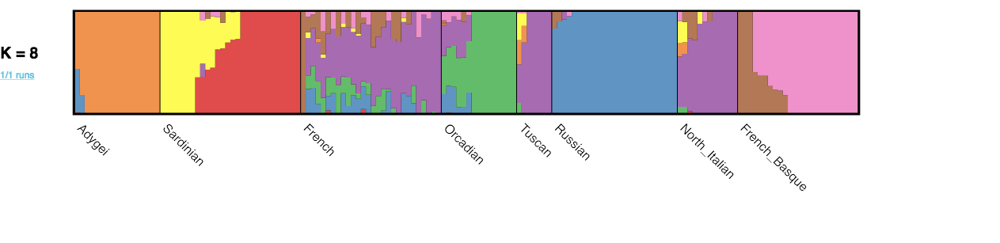
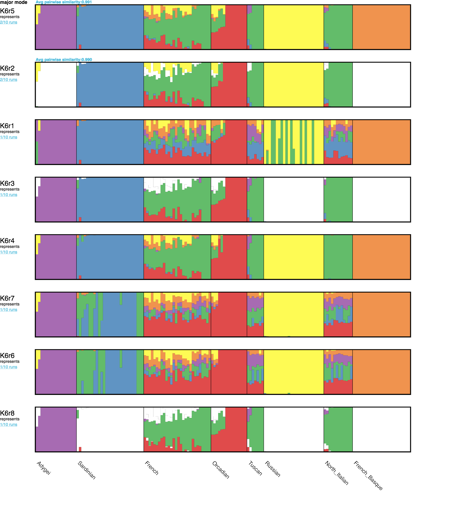
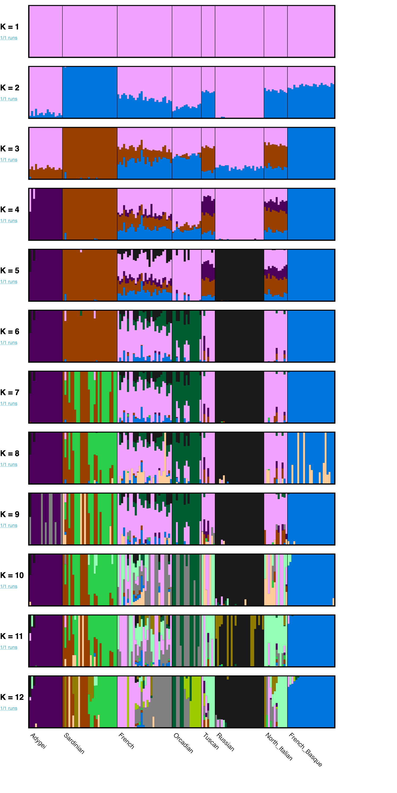

```{r setup, include=FALSE}
knitr::opts_chunk$set(fig.width=6, fig.height=4, fig.path='plot/',
                      echo=TRUE, eval=FALSE, warning=TRUE, message=TRUE)
```

# HGDP Population Structure Workshop


Population structure is a commonplace feature of genetic variation data, and it has importance in numerous application areas, including evolutionary genetics, conservation genetics, and human genetics.  At a broad level, population structure is the existence of differing levels of genetic relatedness among some subgroups within a sample.  This may arise for a variety of reasons, but a common cause is that samples have been drawn from geographically isolated groups or different locales across a geographic continuum. Regardless of the cause, understanding the structure in a sample is necessary before more sophisticated analyses are undertaken. For example, to infer divergence times between two populations requires knowing two populations even exist and which individuals belong to each.  

Two of the most commonly used approaches to describe population structure in a sample are principal components analysis [@Menozzi78;@CavSforza94; @Price06;@Patterson06] and admixture proportion inference [@Pritchard00;@Novembre16a].  In brief, principal components analysis reduces a  multi-dimensional dataset to a much smaller number of dimensions that allows for visual exploration and compact quantitive summaries.  In its application to genetic data, the numerous genotypes observed per individual are reduced to a few summary coordinates. With admixture proportion inference, individuals in a sample are modeled as having a proportion of their genome derived from each of several source populations. The goal is to infer the proportions of ancestry in each source populations, and these proportions can be used to produce compact visual summaries that reveal the existence of population structure in a sample.  

The history and basic behaviors of both these approaches have been written about extentsively, including by some of us, and so we refer readers to several previous publications to learn the basic background and interpretative nuances of these approaches and their derivatives [@Pritchard00; @Falush03; @Rosenberg05; @Hubisz09; @Raj14; @Novembre14;@Falush16; @Alexander09; @Alexander11; @Price06;@Patterson06; @Novembre08a; @McVean09; @Novembre16b]. Here, in the spirit of this volume, we provide a protocol for running these analyses and share some pragmatic caveats that do not always arise in more abstract discussions regarding these methods.  

### Materials 
The protocol we present is based on two pieces of software: 1)  the `ADMIXTURE` software that our team developed [@Alexander09] for efficiently estimating admixture proportions in the "Pritchard-Stephens-Donnelly" model of admixture [@Pritchard00;@Novembre16a].  2) The `smartpca` software developed by Nick Patterson and colleagues for carrying out PCA [@Price06].  Both of these pieces of software are used widely.  We also pair them with downstream tools for visualization, in particular `pong` [@Behr16], for visualizing output of admixture proportion inferences, and `PCAviz` [@Novembre17], a novel R package for plotting PCA outputs.  We also use `PLINK` [@Purcell07; @Chang15] as a tool to perform some basic manipulations of the data (See Chapter X for more background on `PLINK`). 

The example data we use is derived from publicly available single-nucleotide polymorphism (SNP) genotype data from the CEPH-Human Genome Diversity Panel [@Cann02].  Specifically, we will look at Illumina 650Y genotyping array data as first described by Li et al [@Li08].  This sample is a global-scale sampling of human diversity with 52 populations in total, and the raw files are available from the
following link:
<http://hagsc.org/hgdp/files.html>.  These data have been used in numerous subsequent publications and are an important reference set.  

A few technical details are that the genotypes were filtered with a cutoff of 0.25 for the Illumina GenCall score [@GenCall] (a quality score generated by the basic genotype calling software).  Further, individuals with a genotype call rate <98.5% were removed, with the logic being that if a sample has many missing genotypes it may due to poor quality of the source DNA, and so none of the genotypes from that individual should be trusted.  Beyond this, to prepare the data, we have filtered down the individuals to a set of 938 unrelated individuals.  We exclude related individuals as we are not interested in population structure that is due to family relationships and methods such as PCA and `ADMIXTURE` can inadvertently mistake family structure for population structure.  The starting data are available as plink-formatted files `H938.bed` 
`H938.fam`, `H938.bim`, and an accompanying set of population identifiers `H938.clst.txt`, from this link: <https://www.dropbox.com/sh/66p1hhbtx0rb3wt/AAA0aDXVTNhjUi5nH03__D4za?dl=0>.   

As a pragmatic side note, it is common (and recommended) when carrying out analyses of population structure to merge one's data with other datasets that contain populations which may be representative sources of admixing individuals. For example, in analyzing a dataset with African American individuals, it can be helpful to include datasets containing African and European individuals in the analysis. These datasets can be merged with your dataset using software such as `plink`. However, when merging several datasets, one should be aware of potential biases that can be introduced due to strand flips (i.e. one dataset reports genotypes on the '+' strand of the reference human genome, and another on the '-' strand). One precautionary step to detect strand flips is to group individuals by what dataset they derive from and then produce a scatterplot of allele frequencies for pairs of groups at a time.  If strand flips are not being controlled correctly, one will observe numerous variants on the $y=1-x$ line, where $x$ is the frequency in one dataset and $y$ is the frequency in a second dataset.  (Note: this rule of thumb assumes levels of differentiation are low between datasets, as is the case in human datasets in general, but one should still keep this in mind interpreting results). 


### Note about logistics

You may have been given a single tarball with this workshop, or you may have downloaded it from github.  In either case, look in the `data` subdirectory for files.  If the `data` directory is empty (or if you find it is missing any files referred to below, eg, the H938... or H938_Euro... files), then navigate to this link <http://bit.ly/1aluTln> and download all the files as a `.zip` and put them in the data directory.

The commands below assume you are doing the exercises in a sister
subdirectory to `data`.  As such, binary commands are often denoted as
being run by typing `../bin/plink` and the data files referenced are
in `../data` for example. You may want to modify these if you are working in other directories.  You can also updating your PATH variable to make entering commands easier (look on the web to learn this).


### Subsetting Data [read-only]
For running some simple examples below, we will first create a subset of the HGDP sample that is restricted to only European populations. The European populations in the HGDP have the labels 'Adygei', 'Basque', 'French', 'Italian', 'Orcadian', 'Russian', 'Sardinian' and 'Tuscan', so we create a list of individuals matching these labels using an `awk` command, and then use `plink`'s `--keep` option to make a new dataset with output prefix 'H938\_Euro'. 

```{r, engine = 'bash', eval = FALSE}
awk '$3=="Adygei"||$3=="French_Basque"||$3=="French"|| $3=="North_Italian"||$3=="Orcadian"||$3=="Russian"||
$3=="Sardinian"||$3=="Tuscan" {print $0}' data/H938.clst.txt > out/Euro.clst.txt

plink --bfile data/H938 --keep out/Euro.clst.txt --make-bed --out out/H938_Euro
```


### Filter out SNPs to remove linkage disequilibrium (LD) [read-only]

SNPs in high LD with each other contain redundant information.  More worrisome is the potential for some regions of the genome to have a disproportionate influence on the results and thus distort the representation of genome-wide structure.  A nice empirical example of the problem is in Figure 5 of Tian et al [@Tian2008aa], where PC2 of the genome-wide data is shown to be reflecting the variation in a 3.8Mb region of chromosome 8 that is known to harbor an inversion. A standard approach to address this issue is to filter out SNPs based on pairwise LD to produce a reduced set of more independent markers.  Here we use `plink`'s commands to produce a new LD-pruned dataset with output prefix `H938_Euro.LDpruned`.  The approach considers a chromosomal window of 50 SNPs at a time, and for any pair whose genotypes have an association $r^2$ value greater than 0.1, it removes a SNP from the pair.  Then the window is shifted by 10 SNPs and the procedure is repeated:  

```{r, engine = 'bash', eval = FALSE}
plink --bfile out/H938_Euro --indep-pairwise 50 10 0.1
plink --bfile out/H938_Euro --extract plink.prune.in --make-bed --out out/H938_Euro.LDprune
```

[Advanced note: For particularly sensitive results, we recommend additional rounds of SNP filtering based on observed principal component loadings and/or population differentiation statistics. For example, a robust approach is to filter out large windows around any SNP with a high PCA loading, see @Novembre08b].

## Exploring Hardy-Weinberg predictions  [Note: Harvard Micro-course, SKIP]

In this section, you will assess how well the genotypes at each SNP fit
Hardy-Weinberg proportions. Given the population structure in this
dataset, we might have a chance to observe the -Wahlund effect- in
which the observed propotion of heterozygotes is less than expected
due to hidden population structure (thought of another way, each
sub-population is in a sense inbred, lowering the heterozygosity).

### Using plink to get basic gentoype counts

To begin, run the plink `--hardy` command.  It formally
tests for departures from Hardy-Weinberg proportions.  To keep the
analysis simple, use the `--chr` command to limit the analysis to SNPs on chromosome 2.

```{r, engine = 'bash', eval = FALSE}
plink --bfile ~/shared_data/HGDP_Data/H938 --hardy --chr 2 --noweb --out out/H938
```

Next, you are going to read the output of this command into R and visually
explore the predictions of Hardy-Weinberg proportions.

First - we need to deal with a pesky aspect of plink in that it tests
HWE in cases/controls and across the whole sample ("ALL").  We want to
look at just across the whole sample (as we don't have
cases/controls). The `grep` command will pull out only the output lines with "ALL"
in the line.

```{r, engine = 'bash', eval = FALSE}
grep ALL out/H938.hwe > out/H938.hwe_reduced
```

### Plotting in R

Now, we will use the following R function to make a plot of the
frequency of each genotype relative to its allele frequency (note:
actually the code plots only a sampling of 3000 SNPs to avoid an
overloaded plot).  (Credit to Graham Coop for this specific function - see his
lab blog <http://gcbias.org/> as a reference).

```{r}
plot.geno.vs.HW<-function(file,title=""){


	#read in the HW file from plink
	    plink.hwe<-read.table(file,as.is=TRUE)

	    names(plink.hwe)<-c("chr","SNP.id","which.inds","a1","a2",
	      "genotype","obs.het","exp.het","HWE.pval")

	    counts<-sapply(plink.hwe$genotype,function(x){as.numeric(strsplit(x,"/")[[1]])})
	    counts<-t(counts)
	    tot.counts<-rowSums(counts)
	    geno.freq<-counts/tot.counts
	    allele.freq<-(geno.freq[,1]+.5*geno.freq[,2])

	    these.minor<-sample(1:nrow(geno.freq),3000)
	    these.major<-sample(1:nrow(geno.freq),3000)
	    ss.allele<-c(allele.freq[these.minor],1-allele.freq[these.major])
	    ss.geno<-rbind(geno.freq[these.minor,],geno.freq[these.major,c(3,2,1)])


	# If you have adjustcolor library installed the following code is nice...
	    #plot(ss.allele,ss.geno[,1],xlim=c(0,1),ylim=c(0,1),col=adjustcolor("red",0.1), xlab="allele frequency",ylab="genotype #frequency",main=title)
	    #points(ss.allele,ss.geno[,3],xlim=c(0,1),ylim=c(0,1),col=adjustcolor("blue",0.1))
	    #points(ss.allele,ss.geno[,2],xlim=c(0,1),ylim=c(0,1),col=adjustcolor("green",0.1))

	plot(ss.allele,ss.geno[,1], xlim=c(0,1), ylim=c(0,1), col="red", 
	  xlab="allele frequency",ylab="genotype frequency",main=title)
	points(ss.allele,ss.geno[,3],xlim=c(0,1),ylim=c(0,1),col="blue")
	points(ss.allele,ss.geno[,2],xlim=c(0,1),ylim=c(0,1),col="green")

    smooth=1/5
    lines(lowess(ss.geno[,1]~ss.allele,f = smooth),col="black")
    lines(lowess(ss.geno[,3]~ss.allele,f = smooth),col="black")
    lines(lowess(ss.geno[,2]~ss.allele,f = smooth),col="black")

    x=1:1000/1000
    lines(x,x^2,lty=2)
    lines(x,2*x*(1-x),lty=2)
    lines(x,(1-x)^2,lty=2)
    legend(x=0.3,y=1,col=c("red","blue","green",rep("black",2)),
      legend=c("Homozygote AA","Homozygote aa","Heterozygote Aa","Mean","Hardy Weinberg Expectation"),
      pch=c(rep(1,3),rep(NA,2)),lty=c(rep(NA,3),1,2), cex=0.5, pt.cex = 1)
    }
```

You can use this function directly in R to make a plot or you can produce,
for example, a png graphic file with the plot, as shown below.

```{r}
png(file="HGDP_hwe.png")
plot.geno.vs.HW(file="out/H938.hwe_reduced",title="HGDP")
dev.off()
```


#### Questions

1. Do the genotypic frequencies roughly follow the basic patterns expected for Hardy-Weinberg proportions (e.g. $P_{AA}$ is approximately quadratic in p)?

2. Looking more carefully, is the HW prediction for the proportion of heterozygotes given allele frequency generally too high or too low relative to the empirically observed values? What might explain the deviation?

3. Now, go through the same steps for the full H938_Euro set of plink files. Compare the deficiency in heterozygotes between the world-wide data and the European only data. In which is the deficiency smaller? Why might that be the case?

## Allele frequency spectra

The allele frequency spectra is a count of the number of variant
positions that have a particular allele frequency count (i.e. the
"frequency of different frequecies").  This can be done
using the `hist` function in R to make a histogram.  The only trick is
that there is a variable amount of missing data in the sample.  As a
way to avoid this issue, let's focus only on
SNPs that are fully observed (i.e. the total counts of individuals =
all 938 individuals for the full data problem).

### Computing and plotting a MAF frequency spectra

```{r}
plot.MAF <- function(file){
  # Read in the HWE table and compute counts and allele frequencies
  hwe<-read.table(file,as.is=TRUE)
  names(hwe)<-c("chr","SNP.id","which.inds","a1","a2","genotype","obs.het","exp.het","HWE.pval")
  counts<-sapply(hwe$genotype,function(x){as.numeric(strsplit(x,"/")[[1]])})
  counts<-t(counts)
  tot.counts<-rowSums(counts)
  allele.counts<-(2*counts[,1]+counts[,2])

  # Flip allele counts so that we are sure we always have the minor
  # allele frequency
  # (Note: this uses a trick based on boolean math where true/false = 1/0).
  counts.maf = allele.counts*(allele.counts<=2*tot.counts-allele.counts) + (2*tot.counts-allele.counts)*(allele.counts>2*tot.counts-allele.counts)

  # Set the number of individuals by looking at the sites w/ the most
  # observed data
  n=max(tot.counts)

  # Make the plot but filter on using only sites with fully observed
  # data (i.e. totcounts==n)
  hist(counts.maf[tot.counts==n],
   xlab="Minor allele count", 
   ylab="# of SNPs",
   main="Allele frequency spectra",breaks=n)

  # Plot the expected minor allele frequency spectra for the standard
  # neutral model (i.e. constant size population, all loci neutral)
  # To do so we compute, Watterson's estimator of Theta
  S=sum(tot.counts==n & counts.maf>0)
  thetaW=S/sum(1/seq(1,2*n-1))
  # Which determines the expected AFS
  expectedAFS=(1/seq(1,n)+1/(n*2-seq(1,n))) * thetaW
  # And then plot
  lines(seq(1,n),expectedAFS,col=2)
  # Note: This adds a red line displaying the expected AFS shape
  # controlled to match the data w.r.t to Watterson's Theta (i.e. the total number of SNPs).
}
```

```{r}
plot.MAF("out/H938.hwe_reduced")
```

#### Questions

1. The distribution of MAF's does not have the shape you would expect for
a constant-sized population.  In what ways does it depart from the
expectation?

2. What is at least one plausible explanation for the departures?  (Hint:
This is SNP array data not sequencing data).

#### Follow-up Activities (Optional)

1.  Carry out the same exercise data with a sequencing data set (for example, 1000 Genomes data) or exome chip data.

    
### Running `ADMIXTURE`

Though, structure within Europe is subtle, we can run the program `admixture` on our set of 6 Euroepan sub-populations to explore the structure within it. 

The `ADMIXTURE` software (v 1.3.0 here) comes as a pre-compiled binary executable file for either Linux or Mac operating systems. To install, simply download the package and move the executable into your standard execution path (e.g. '/usr/local/bin' on many linux systems).  Once installed, it is straightforward to run `ADMIXTURE` with a fixed number of source populations, commonly readdenoted by $K$. For example, to get started let's run ADMIXTURE with $K$=8 as there are 8 distinctly labelled populations in the dataset:
```{r, engine = 'bash', eval = FALSE}
admixture out/H938_Euro.LDprune.bed 8
```    
`ADMIXTURE` is a maximum-likelihood based method, so as the method runs, you will see updates to the log-likelihood as it converges on a solution for the ancestry proportions and allele frequencies that maximize the likelhood function.  The algorithm will stop when the difference between successive iterations is small (the 'delta' value takes a small value).  A final output is an estimated $F_{ST}$ value [@Kent09] between each of the source populations, based on the inferred allele frequencies.  These estimates reflect how differentiated the source populations are, which is important for understanding whether the population structure observed in a sample is substantial or not (values closer to 0 reflect less population differentiation).

After running, `ADMIXTURE` produces two major output files.  The file with suffix `.P` contains an $L \times K$ table of the allele frequencies inferred for each SNP in each population.  The file with suffix `.Q` contains an $N \times K$ table of inferred individual ancestry proportions from the $K$ ancestral populations, with one row per individual. 

For our example dataset with $K$=8, this will be a file called `H938.LDpruned.8.Q`. This file can be used to generate a plot showing individual ancestry. In `R`, this can be done using the following commands:
```{r, eval = TRUE, fig.height=2.5, fig.width=7.5}
library(RColorBrewer)
getwd()
tbl <- read.table("out/H938_Euro.LDprune.8.Q")
par(mar=c(1,4,2,2))
barplot(t(as.matrix(tbl)), col=brewer.pal(8,"Set1"),
        ylab="Admixture Proportions",border=NA,space=0)
```
Each thin vertical line in the barplot represents one individual and each color represents one inferred ancestral population. The length of each color in a vertical bar represents the proportion of that individual's ancestry that is derived from the inferred ancestral population corresponding to that color. The above image suggests there are some genetic clusters in the data, but it's not a well organized data display. 


Or as a better approach, read in the population
id's of each individual and plot the individuals sorted by these identfiers:

```{r}
plot.admixture.labeled <- function(clst_file, fam_file, q_file){
  #Read in the Qmatrix
  Q = read.table(q_file)
  Qmat = as.matrix(Q)
  
  # To be able to label the graph we read in a
  # .clst file with population "cluster" labels for each indiv
  clst = read.table(clst_file)
  
  # And a fam file from the plink data
  fam = read.table(fam_file)
  
  # Use the match function to link the family ids with the cluster id
  clst_unord=clst$V3[match(fam$V2,clst$V2)]
  
  # Re-order alphabetically
  ordered_indices=order(clst_unord)
  QmatO=Qmat[ordered_indices,]
  
  # Compute where we will place the population labels in the barplot
  n=length(ordered_indices)
  clst_ord=clst_unord[ordered_indices]
  breaks=c(0,which(clst_ord[1:(n-1)]!=clst_ord[2:n]),n)
  nbrks=length(breaks)
  midpts=(breaks[1:(nbrks-1)]+breaks[2:nbrks])/2
  
  # Make the barplot
  barplot(t(QmatO),col=c("red","blue","yellow","orange","purple","brown"),border=NA,space=0,inside=TRUE)
  abline(v=breaks,lwd=2)
  mtext(levels(clst_ord),side=1,at=midpts,las=2)
}
```

```{r}
plot.admixture.labeled("data/H938.clst.txt","data/H938_Euro.fam","out/H938_Euro.LDprune.8.Q")
```

#### Questions
1. Are individuals from the population isolates (Adygei, Baseque, Orcadian, and Sardinian) inferred to have distinct ancestral populations?

2.  Are the French and Italian individuals completely distinguished as being from distinct populations?

3.  Which sampled population would seem to have the most internal population structure?

#### Follow-up Activities (Optional)

1.  Run the method with K=4 and K=5 and describe results.

2.  Use the worldwide pruned LD data and run with K=6 or K=7 (i.e. revisiting Rosenberg's classic paper). [Note : this will take a while, best to run it on your own computer, or use a different algorithm like `teraStructure`]

### Exploring ADMIXTURE results with the PONG software [Optional]


To improve the visualization, one can use a package dedicated to plotting ancestry proportions [@Rosenberg04; @Kopelman15; @Behr16]. Here we use a post-processing tool `pong` [@Behr16], which visualizes individual ancestry with similarity between individuals within clusters. You will most likely want to install 'pong' on a local machine as it initializes a local web server to display the results.  

To run `pong` requires setting up a few files: 1) an `ind2pop` file that maps individuals to populations; 2) a `Qfilemap` file that points `pong` towards which '.Q' files to display; These are easy to build up from the command-line using the `Euro.clst.txt` file we built above, and an `awk` command to output tab-seperated text to a file with the `Qfilemap` suffix added to whatever file prefix we're using to organize our runs:

```{r, engine='bash',eval=FALSE}
cut -d' ' -f3 out/Euro.clst.txt > out/H938_Euro.ind2pop
FILEPREFIX=out/H938_Euro.LDPrune
K=8
awk -v K=$K -v file=$FILEPREFIX 'BEGIN{ \
printf("ExampleRun\t%d\t%s.%d.Q\n",K,file,K) 
}' > $FILEPREFIX.Qfilemap 
```
Note when building the `.Qfilemap` one needs to use tabs to seperate the columns for `pong` to read the file correctly.

Then to run `pong`, we use following command:
```{r, engine = 'bash', eval = FALSE}
pong -m out/H938_Euro.LDprune.Qfilemap -i out/H938_Euro.ind2pop
```       
and open a web browser to `http://localhost:4000/` to view the results. 

Here's  an example of what you should see:



From this visualization we can see the admixture model fits most individuals of the Adygei, Orcadian, and Russian samples as being derived each from a single source population (represented by orange, green, and blue respectively); the Sardinian and the French Basque samples are modeled as comprising individuals from two source populations each (yellow/red for Sardinia, brown/pink for French Basque); and the French, Tuscan, and North Italian samples are generally estimated to have a majority component of ancestry from a single source population ('purple') though with notable admixture with other sources.  A first conclusions is that the population labels do not capture the complexity of the population structure.  There is apparent cryptic structure within some samples (e.g., Sardinia) and minimal differentiation between other samples (North Italian and Tuscan samples for instance).  

We can run ADMIXTURE multiple times with -s flag specifying random seeds. This is useful determining if ADMIXTURE finds global optima. Pong summarizes modality and provides `check to highlight multimodality` checkbox whitening populations with ancestry matrices agreeing the mode. One can also click on and visualize only one cluster.

```{r, engine='bash',eval=FALSE}
# run admixture multiple times
K=6
prefix=H938_Euro.LDprune

for r in {1..10}
do
admixture -s ${RANDOM} out/H938_Euro.LDprune.bed $K
mv out/${prefix}.${K}.Q out/${prefix}.K${K}r${r}.Q
done
# create a pong parameter file
for r in {1..10}
do
awk -v K=$K -v r=$r -v file=${prefix}.K${K}r${r} 'BEGIN{ \
printf("K%dr%d\t%d\t%s.Q\n",K,r,K,file)
}' >> out/${prefix}.multiplerun.Qfilemap
done
# run pong
pong -m out/${prefix}.multiplerun.Qfilemap -s .99 -i out/H938_Euro.ind2pop
```




Here inferred ancestry components for North Italian are different across multiple runs of ADMIXTURE.

### Considering different values of $K$
In a typical analysis, one typically wants to explore the sensitivity of the results to the choice of $K$.  One approach is to run ADMIXTURE with various plausible values of $K$ and compare the performance of results visually and using cross-validation error rates. Here is a piece of `bash` command-line code that will run `ADMIXTURE` for values of $K$ from 2 to 12, and that will build a file with a table of cross-validation error rates per value of $K$.  

```{r, engine = 'bash', eval = FALSE}
# Run for different values of K
prefix=H938_Euro.LDprune
Klow=1
Khigh=12
for ((K=$Klow;K<=$Khigh;K++)); \
do 
  admixture --cv out/$prefix.bed $K | tee log.$prefix.${K}.out; 
done
```
Then let's compile results on cross-validation error across values of K:
```{r, engine = 'bash', eval = FALSE}
prefix=H938_Euro.LDprune
Klow=1
Khigh=12
echo '# CV results' > $prefix.CV.txt
for ((K=$Klow;K<=$Khigh;K++)); do 
  awk -v K=$K '
    $1=="CV"{print K,$4}' out/log.$prefix.$K.out >> out/$prefix.CV.txt; 
done
```
and build a Qmapfile for pong:
```{r, engine='bash', eval = FALSE}
prefix=H938_Euro.LDprune
Klow=1
Khigh=12
echo '# Qfilemap' > out/$prefix.Qfilemap
for ((K=$Klow;K<=$Khigh;K++)); \
do 
  awk -v K=$K -v prefix=$prefix 'BEGIN{ \
    printf("K%d\t%d\t%s.%d.Q\n",K,K,prefix,K)
  }' >> out/$prefix.Qfilemap; 
done
```     

Now let's inspect the outputs.  First let's make a plot of the cross-validation error as a function of $K$:
```{r, eval = TRUE, fig.width=3.25, fig.height=3}
tbl = read.table("out/H938_Euro.LDprune.CV.txt")
plot(tbl$V1,tbl$V2,xlab="K",ylab="Cross-validation error",pch=16,type='l')
```

The cross-validation error suggests a single source population can model the data adequately and larger values of $K$ lead to over-fitting.  Let's now inspect the 'pong' outputs. 

```{r, engine = 'bash', eval = FALSE}
pong -m out/H938_Euro.LDprune.Qfilemap -i out/H938_Euro.ind2pop
```  



Here we see how as $K$ increases through to $K=6$, the Sardinian, Basque, Adygei, and Russian samples are modeled as descended from unique sources, at $K=7$ and $K=8$ structure within the Sardinian and Basque samples is revealed, though the Basque sub-structure is not stable at higher values of $K$.  The values of $K=9$ and above make increasingly finer scale divisions that are difficult to interpret.  

Overall, it's worth noting that the visual inspection of the results suggests several "real" clusters in the data, though in this case the cross-validation supports a value of $K=1$.  This highlights a long-standing known issue with admixutre modeling: the selection of $K$ is a difficult problem to automate in a way that is robust.  

### Some advanced options

Running `ADMIXTURE` with the `-B` option provides estimates of standard errors on the ancestry proportion inferences. The `-l` flag runs `ADMIXTURE` with a penalized likelihood that favors more sparse solutions (i.e., ancestry proportions that are closer to zero).  This is useful in settings where small, possibly erroneous ancestry proportions may be overinterpreted. By using the `-P` option, the population allele frequencies inferred from one dataset can be provided as input for inference of admixture proportions in a second dataset. This is useful when individuals of unknown ancestry are being analyzed against the background of a reference sample set.  Please see the `ADMIXTURE` manual for a complete listing of options and more detail, and we encourage testing these options in test datasets such as the one provided here. 
    

## PCA

Principal components analysis is a commonly used way to investigate
population structure in a sample (though it is also sensitive to close
relatedness, batch effects, and long runs of LD, and you should watch
for these potential effects in any analysis). Here you will run PCA on the
Euroepan subset of the data with the LD pruned data.

  
### PCA with SMARTPCA
Comparing ADMIXTURE and PCA results often helps give insight and confirmation regarding population structure in a  sample. To run PCA, a standard package that is well-suited for SNP data is the `smartpca` package maintained by Nick Patterson and Alkes Price (at http://data.broadinstitute.org/alkesgroup/EIGENSOFT/). To run it, we first set-up a basic `smartpca` parameter file from the command-line of a `bash` shell:

```{r, engine = 'bash', eval = FALSE}
PREFIX=H938_Euro.LDprune
echo genotypename: out/$PREFIX.bed > out/$PREFIX.par
echo snpname: out/H938_Euro.LDprune.bim >> out/$PREFIX.par
echo indivname: out/H938_Euro.LDprune.PCA.fam >> out/$PREFIX.par
echo snpweightoutname: out/H938_Euro.LDprune.snpeigs >> out/$PREFIX.par
echo evecoutname: out/H938_Euro.LDprune.eigs >> out/$PREFIX.par
echo evaloutname: out/H938_Euro.LDprune.eval >> out/$PREFIX.par
echo phylipoutname: out/H938_Euro.LDprune.fst >> out/$PREFIX.par
echo numoutevec: 20 >> out/$PREFIX.par
echo numoutlieriter: 0 >> out/$PREFIX.par
echo outlieroutname: out/H938_Euro.LDprune.out >> out/$PREFIX.par
echo altnormstyle: NO >> out/$PREFIX.par
echo missingmode: NO >> out/$PREFIX.par
echo nsnpldregress: 0 >> out/$PREFIX.par
echo noxdata: YES >> out/$PREFIX.par
echo nomalexhet: YES >> out/$PREFIX.par
```   
This input parameter file runs `smartpca` in its most basic mode (i.e. no automatic outlier removal or adjustments for LD - features which you might want to explore later). 

As a minor issue, `smartpca` ignores individuals in the `.fam` file if they are marked as missing in the phenotypes column. This `awk` command provides a new `.fam` file that will automatically include all individuals.
    
```{r, engine = 'bash', eval = FALSE}
awk '{print $1,$2,$3,$4,$5,1}' out/H938_Euro.LDprune.fam > out/H938_Euro.LDprune.PCA.fam
```
Now run `smartpca` with the following command. 
    
```{r, engine = 'bash', eval = FALSE}
smartpca -p ./out/H938_Euro.LDprune.par
```   
You will find the output files in the `out` sub-directory as specified in the parameter file.

### Simple plots of the results

And make a plot of PC1 vs PC2.

```R
# Read in eigenvectors file
PCA=read.table("out/H938_Euro.LDprune.eigs")
names(PCA)=c("ID",paste("PC",(1:20),sep=""),"CaseControl")

# Note smartpca pushes the plink family and individual ids together so
# we need to extract out the ids afresh; note this code works just for
# this case
ids=substr(PCA$ID,start=6,stop=20)

# Read in clst table and fam file
clst=read.table("../../data/Euro.clst.txt")
# The list of countries as ordered in the fam file
clst_unord=clst$V3[match(ids,clst$V2)]

# Make a blank plot of the right size
plot(PCA$PC2,PCA$PC1,type="n",xlab="PC2",ylab="PC1")
# Add text labels at PC positions with abbreviations of the full
# labels.  The substr function will be used to make automatic abbreviations.
text(PCA$PC2,PCA$PC1,substr(clst_unord,1,2))
```

Make additional plots of PC3 vs PC4, PC5 vs PC6, and PC7 vs PC8.  When
looking at each plot inspect each axis indepedently to understand what
individuals each PC is distinguishing from one another.


#### Plotting PCA results with PCAviz
The PCAviz package can be found at https://github.com/NovembreLab/PCAviz. It provides a simple interface for quickly creating plots from PCA results. It encodes several of our favored best practices for plotting PCA (such as using abberviations for point characters and plotting median positions of each labelled group).  To install the package use:
```{r, eval=FALSE,echo=TRUE}
install.packages("devtools")
devtools::install_github("NovembreLab/PCAviz",build_vignettes = TRUE)
```

The following command in `R` generates plots showing each individual sample's position in the PCA space and the median position of each labelled group in PCA space:

```{r, eval = TRUE, echo=TRUE, results='hide',warning=FALSE,message=FALSE, fig.height=10,fig.width=10}
library(PCAviz)
library(cowplot)
prefix="out/H938_Euro.LDprune"
nPCs = 20

# Read in individual coordinates on PCs and eignvalues
PCA=read.table(paste(prefix,".eigs",sep=""))
names(PCA)=c("ID",paste("PC",(1:nPCs),sep=""),"case.control")
PCA=PCA[,1:(nPCs+1)] # Remove case/control column
eig.val = sqrt(unlist(read.table(paste(prefix,".eval",sep="")))[1:nPCs])
sum.eig= sum(unlist(read.table(paste(prefix,".eval",sep=""))))

# Read in snp weightings matrix
snpeigs = read.table(paste(prefix,".snpeigs",sep=""))
names(snpeigs)=c("ID","chr","pos",paste("PC",(1:nPCs),sep=""))
snpeigs$chr = factor(snpeigs$chr)
rownames(snpeigs) <- snpeigs$ID; snpeigs = snpeigs[,-1]

# Note smartpca pushes the plink family and individual ids together so we need to extract out the ids afresh
tmp=unlist(sapply(as.character(PCA$ID),strsplit,":"))
ids=tmp[seq(2,length(tmp),by=2)]
PCA$ID=ids

# Read in the group/cluster labels 
clst=read.table("out/Euro.clst.txt")
clst_unord=clst$V3[match(ids,clst$V2)]  # Order them to match the ids of PCA object
PCA = as.data.frame(PCA)
PCA = cbind(PCA,clst_unord)
names(PCA)[ncol(PCA)] <- "sample"

# Build the PCAviz object
hgdp <- pcaviz(dat = PCA, sdev=eig.val, var= sum.eig, rotation = snpeigs)
hgdp <- pcaviz_abbreviate_var(hgdp,"sample")

# Make PCA plots
geom.point.summary.params = list(shape = 16,stroke = 1,size = 5,
                                 alpha = .7,show.legend = F)
plot1 <- plot(hgdp,coords = paste0("PC",c(1,2)), color = "sample",
              geom.point.summary.params = geom.point.summary.params ,scale.pc.axes = 0.6)
plot2 <- plot(hgdp,coords = paste0("PC",c(2,3)), color = "sample",
              geom.point.summary.params = geom.point.summary.params ,scale.pc.axes = 0.6)
plot3 <- plot(hgdp,coords = paste0("PC",c(4,5)), color = "sample",
              geom.point.summary.params = geom.point.summary.params ,scale.pc.axes = 0.6)
plot4 <- plot(hgdp,coords = paste0("PC",c(5,6)), color = "sample",
              geom.point.summary.params = geom.point.summary.params ,scale.pc.axes = 0.6)

plot_grid(plot1,plot2,plot3,plot4)
```

First one may notice several populations are separated with PC1 and PC2, with the more isolated populations being those that were most distinguished from the others by `ADMIXTURE`. PC4 distinguishes a subset of Orcadian individuals and PC5 distinguishes two Adygei indiviuals.  PC6 corresponds to the cryptic structure observed within Sardinians in the `ADMIXTURE` analysis. 

As an alternative visualization it can be helpful to see the distribution of PC coordinates per population for each labelled group in the data:
```{r, eval = TRUE,fig.height=8,fig.width=8}
pcaviz_violin(hgdp,pc.dims =paste0("PC", c(1:3)),plot.grid.params = list(nrow = 3))
```

As mentioned above in the section on LD, it is useful to inspect the PC loadings to ensure that they broadly represent variation across the genome, rather than one or a small number of genomic regions [@Duforet-Frebourg16]. SNPs that are selected in the same direction as genome-wide structure can show high loadings, but what is particularly pathological is if the only SNPs that show high loadings are all concentrated in a single region of the genome, as might occur if the PCA is explaining genomic structure (such as an inversion) rather than population structure.

```{r, eval = TRUE, fig.height=6, fig.width=8}
for (i in 1:5){
  plotname<-paste("plot",i,sep="")
  plot <- pcaviz_loadingsplot(hgdp,pc.dim=paste0("PC",i), 
                              min.rank=0.8,gap=200,color = 'chr', 
                              geom.point.params = list(show.legend = FALSE)) +
          xlab("SNPs") + ylab(paste0("PC",i," loading"))
  assign(plotname,plot)
}
# grep common legend
plot <- pcaviz_loadingsplot(hgdp,pc.dim=paste0("PC",1), 
                            min.rank=0.8,gap=200,color = 'chr') +
        guides(color = guide_legend(nrow=2, byrow=TRUE)) + 
        theme(legend.position="bottom", legend.justification = "center")
plot_legend <- get_legend(plot)
# plot loadings
prow <- plot_grid(plot1,plot2,plot3,plot4,plot5, nrow=5, align="vh")
plot_grid(prow, plot_legend, ncol = 1, rel_heights = c(1, .2))

```

The proportion of total variance explained by each PC is a useful metric for understanding structure in a sample and for evaluating how many PCs one might want to include in downstream analyses. This can be computed as  $\lambda_i / \sum_{k} \lambda_k$, with $\lambda_i$ being eigenvalues in decreasing order, and is plotted below:
```{r, eval = TRUE, echo=TRUE,warnings=FALSE,fig.width=3.25,fig.height=3}
screeplot(hgdp,type='pve')  + ylim(0,0.018)+
      theme(axis.text.x = element_text(angle = 90, hjust = 1)) +
      theme(axis.line = element_line(size = 1, linetype = "solid"))
```

The results show that the top PCs only explain a small fraction of the variance (<1.5%) and that after about $K=6$ the variance explained per PC becomes relatively constant; roughly in line with the visual inspection of the `admixture` results that revealed $K=6$ may be reasonable for this dataset. 


#### Questions (Part A)

1. Are individuals from the population isolates (Adygei, Baseque, Orcadian, and Sardinian) clearly separated by at least one of the top PCs you’ve plotted?
2. Are the French and Italian individuals completely separated in at least one of the top PCs you’ve plotted?
3. Do any of the PCs replicate the structure within Sardinia that was inferred in the admixture analysis above?
4. Do the admixture results and PCA results seem to agree with regards to the relationship of the French, Italian, and Orcadian samples?

We have looked at the top 8 PCs, but perhaps we should be looking at
more. Plot the proportion of variance explained by each PC (i.e. the value
of each eigenvalue normalized by the sum).

#### Questions (Part B)
1. Based on the proportion of the variation explained - there are a number of PCs that stand out as being more relevant for explaining variation. About how many?

2. From your plots of PC1-PC8 you should see that the lower PCs seem to be picking up individual-level structure, isolating single individuals. At what PC does this first happen?

```R
    eval=read.table("H938_Euro.LDprune.eval")
    plot(1:length(eval$V1),eval$V1/sum(eval$V1),xlab="PC",ylab="Eigenvalue")
```


#### Follow-up Activities (Optional)

1.  Read in the `.snpeigs` file and plot the weight of each SNP along
    the genome for each of the top PCs.  If the spatial clustering of
    the weights is not distributed genome-wide it may indicate a PC is
    identifying some local genomic structure rather than genome-wide
    structure.  For example, in many European samples, a PC might
    indentify a common inversion polymorphism on chr 8p23 or 17q.

2.  Run PCA on the worldwide pruned LD data and inspect the results.


##  Discussion

Our protocol above is relatively straightfoward and presents the most basic implementation of these analyses. Each analysis sofware (`ADMIXTURE` and `smartpca`) and each visualization package (`pong` and `PCAviz`) contain numerous other options that may be suitable for specific analyses and we encourage the readers to spend time in the manuals of each.  Nonetheless, what we have presented is a useful start and a standard pipeline that we use in our research.

Two broad perspecives we find helpful useful to keep in mind are: 1) How the admixture model and PCA framework are related to each other indirectly as different forms of sparse factor analyss [@Engelhardt10]; 2) How the PCA framework in particular can be considered as a form of efficient data compression.  Both of these perspectives can be helpful in interpreting the outputs of the methods and for appreciating how these approaches best serve as helpful visual exploratory tools for analyzing structure in genetic data.  These methods are ultimately relatively simple statistical tools being used to summarize complex realities.  They are part of the toolkit for analysis, and often are extremely useful for framing specific models of population structure that can be further investigated using more detailed and explicit approaches.


## Demonstration of spurious association due to population structure [Take-Home]

One consequence of population structure is that it can cause spurious
associations with phenotypes.  In this exercise you will generate a
phenotype that has no dependence on genetics - but that does depend on
population membership (imagine a trait determined by diet or some
other non-genetic factor that varies among populations).  You will try
to map it and inspect whether the resulting association test p-values
are consistent with the null of no genetic effects.

### Generate a phenotype [read-only]

First - let's make a file where each individual is assigned
a somewhat arbitrary base phenotypic value given by what population they are
from (Adygei = 5, Basque = 2, Italian = 5, Sardinian = 0; French = 8;
Orcadian = 10)

```bash
awk '$3=="Adygei"{print $1,$2,5}\
     $3=="Basque"{print $1,$2,2}\
     $3=="Italian"{print $1,$2,5}\
    $3=="Sardinian"{print $1,$2,0}\
    $3=="French"{print $1,$2,8}\
    $3=="Orcadian"{print $1,$2,10}' \
    ../data/Euro.clst.txt > out/pheno.base.txt
```

Now, using R, let's add some variation around this base value to
produce individual-level phenotypes.  Note: Nothing genetic about this phenotype!

```R
pheno.base=read.table("out/pheno.base.txt")
# Scale the base phenotype to mean 0, sd 1
pheno.base.scale=scale(pheno.base$V3)
# Add some normally distributed noise (with as much variance as the base phenotype itself already has)
pheno.sim=rnorm(length(pheno.base$V3),mean=pheno.base$V3,sd=1)
# Output the phenotype to a file
write.table(cbind(pheno.base[,1:2],pheno.sim),"out/pheno.sim.txt",quote=FALSE,row.names=FALSE,col.names=FALSE)
```

We will use the `pheno.sim.txt` as our phenotype file for mapping.

### Map the trait using plink mapping functions

The `--assoc` command in plink will produce p-values for a basic
regression of phenotype on additive genotypic score.

```bash
plink --bfile data/H938_Euro --pheno out/pheno.sim.txt --assoc --out out/H938_Euro_sim.pheno --noweb
```
### Exploring the results:  A Manhattan plot

Read in the plink results contained in the `.qassoc` output file and
make a Manhattan plot of the results.

```R
qassoc=read.table("out/H938_Euro_sim.pheno.qassoc",header=TRUE)

# Make a Manhattan plot
# First set-up a plot of the right size
plot(1:length(qassoc$SNP),type="n",xlab="SNP index",ylab="-log10(p-value)",ylim=c(3,max(-log10(qassoc$P),na.rm=TRUE)+1))
# Next add the points (note: we only plot points with
# -log10(p-value)>3 to minimze the number of points plotted)
plot.these=which(-log10(qassoc$P)>3)
points(plot.these,-log10(qassoc$P[plot.these]),col=1+qassoc[plot.these,"CHR"]%%2,pch=16)
# Put in a line for a Bonferroni correction (0.05 / length(qassoc$SNP)
abline(h=-log10(0.05/length(qassoc$SNP)),lty=2,col="gray")
```

#### Questions (Part A)
1. Which chromosomes locations would you be tempted to follow up here?

Inspect a table of the most extreme hits:

```R
print(qassoc[head(order(qassoc$P),n=20),])
```

#### Questions (Part B)

1. The peak on chromosome 6 is near what famous region of the human genome?

2. The peak on chromosome 4 spans the gene for TLR6, a toll-like receptor involved in bacterial recognition that was noted as being highly differentied in Europe (i.e. high FST ) by Pickrell et al (2009) in their analysis of this data. Why might a highly differentiated SNP show a stronger signal of spurious association than other SNPs?


### Exploring the results: A quantile-quantile plot.

Use the following code in R to make a plot of the observed vs. expected p-values matched by quantile.

```R
# Read in the p-values
qassoc=read.table("out/H938_Euro_sim.pheno.qassoc",header=TRUE)
# Produce expected p-values from the null (i.e. perfectly uniformly
# distributed).
nTests=length(qassoc$SNP)
Unif=seq(1/nTests,1-1/nTests,length=nTests)
# Sort the -log10 p-values (i.e. match on quantile)
logUnifOrder=order(-log10(Unif),decreasing=TRUE)
SNPorder=order(-log10(qassoc$P),decreasing=TRUE)
# Plot the p-values against against each other (Note: we do for only
# the top 150K SNPs to make the number of points plotted smaller)
qmax=max(-log10(qassoc$P),na.rm=TRUE)
plot(-log10(Unif[logUnifOrder][1:150e3]),-log10(qassoc$P[SNPorder][1:150e3]),pch=16,cex=0.5,xlab="-log(p)
Expected",ylab="-log(p) Observed",,ylim=c(0,qmax));
# put in a line for the expected relationship (y=x)
abline(0,1);
# Put in a line for a Bonferroni correction (0.05 / length(qassoc$SNP)
abline(h=-log10(0.05/length(qassoc$SNP)),lty=2,col="gray")
```

#### Questions (Part C)

1. Does there appear to be evidence for a genome-wide inflation of p-values?

#### Follow-up Activities

1.  Simulate p-values from the null uniform distribution and draw a qq-plot.

2.  Consider how genomic control be applied in this situation to control population stratficiation (See Price et al. Nature Reviews Genetics to get a better idea of genomic control)

3.  Use the PCs you've computed already (or plink's MDS functions) to rerun the association test controlling for population stratification and plot a QQ-plot

